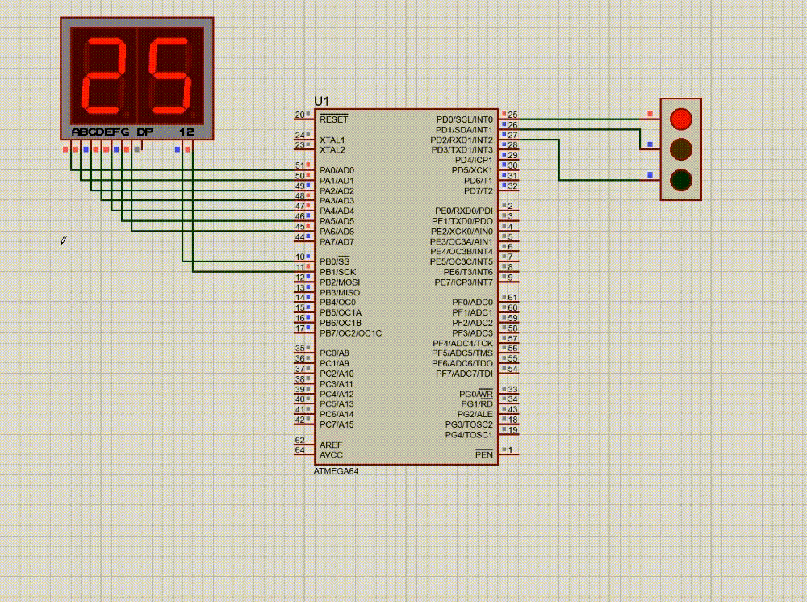

# Traffic Light Implementation with MPX7 on atmega64 Microcontroller

## Required Tools
```
ATMEGA64 microcontroller
1 Traffic Light Module
1 MPX Seven Segment Display (Common Cathode)
```

## Project Overview

To begin this project, I decided to focus only on the 7-segment display, completely ignoring the traffic light module at first. This approach—breaking a big problem into smaller parts—made the development process much easier. </br>

The first goal was to create a counter that counts from 99 down to 0. </br>

Initially, I tried using nested loops to build the counter logic. However, this approach had a limitation: it could only show either the tens digit or the ones digit, but not both at the same time. And switching between them quickly enough so the human eye couldn’t notice was not reliable. </br>

Then I came up with a better solution:</br>
Instead of looping, I simply took the two-digit number and split it into tens and ones using the / and % operators in C++. This way, both digits could be extracted and displayed correctly on the 7-segment module.


